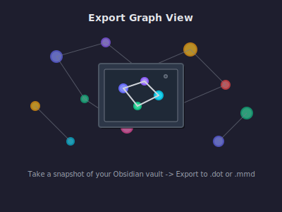

---

# Export Graph View Plugin

Obsidian's built-in Graph View is a must-have dynamic knowledge graph, but not everyone has Obsidian installed on their machine. Sometimes you need to carry a snapshot with you to paint your ideas to friends and colleagues - that's where EGV comes in.

EGV exports to two capable yet VERY different formats with that freedom in mind.

## Quick Start

1. Install from Community Plugins
2. Chose focus mode (single parent or full graph)
3. Choose relationship strategy (tags, links, folders)
4. Export your new snapshot graph to your vault
5. Open with any Mermaid/GraphViz tool
6. Dataviz heaven on the go!

## Easy Mermaid Graphs
Mermaid's limited scale makes it suited to smaller graphs, yet its big strength is how portable mermaid can be with minimal setup.

EGV's 'Single-parent focus' mode was built with `.mmd` format in mind. It's like a narrow lens on a specific note or tag you want to paint all relationships from in your exported chart. Try it out.

You're not forced to use Single-parent focus if you love `.mmd` format and want to try getting away with larger exported charts. EGV offers some safeguards in the Full graph mode for you to tweak here.

But, for bigger visuals, most people would recommend exporting to `.dot` format.

## Bigger Snapshots with Dot (GraphViz)

Full-graph focus is suited to `.dot` format and EGV lets you include relationship metadata in your exported `.dot` graph or cluster note-groups or tag-groups into subgraphs if you want to take full advantage of what `.dot` editors like Gephi can do.

# Support

Please post an issue or get in touch if you find any bugs. I've made a pretty big update for version 1.2.2 but I've yet to complete testing, so this plugin is still in beta.

I'll be the first to admit I use Gephi (and .dot graphs) a couple of times a year at most, so I'm much less likely to notice if there are any problems in EGV's .dot workflow.
